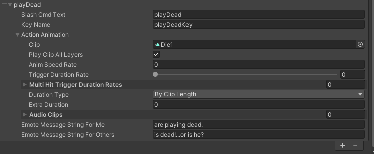

# EmoteChat

**Author:** RatherGood1

**Compatibility: (tested on) Suriyun** **MMORPG Kit Version 1.65f**

**Description:** Provides slash commands or hotkey activation to perform emote
animations.

**Other Dependencies:**

You need to provide your own animations. Demo uses simple kit animations.

**Core MMORPG Kit modifications:**

None. Requires edits to UIGamePlay components.

**Description:**

By slash command “/dance” or key press will send emote command to all players in
scene. Animation plays for sender. Messages are generated depending on the
listener.

**Instructions for use:**

1.  On your CanvasGameplay prefab replace the UIChat_Standalone with the
    UIChatMessageRGEmoteMod” prefab

    1.  The ew Prefab is provided In the
        Assets/RatherGood/MMOKit/EmoteChat/Prefabs folder

    2.  Hint: you can locate this on your GameInstance component in your init
        scene under “UI Scene Gameplay”

        

2.  Recommended: Copy the prefab to another folder outside the kit before
    editing.

3.  The EmoteData database component is located on the UI and therefore will be
    shared with any players with the same UI prefab.

4.  Save the prefab.

5.  Edit the Demo animation data or create a new Emote Data Scriptable object
    for your Emote Animation Data:

6.  Right click in a folder and select: Create -\> RatherGoodGames -\> EmoteData
    and set up your animations actions as desired.

**EmoteData Fields:**

**slashCmdText**: This is the text the user types in the chat window to activate
the emote.

**KeyName**: Assign a key name to enable using this animation to be activated by
key press. The name must EXACTLY match the name used in your GameInstance
InputSettingsManager component in your Init scene. (See example below).

**ActionAnimation**: Insert the appropriate animation. (Not all animation types
work with ActionAnimations)

**PlayClipAllLayers**: (Usually should be true) All layers will play animation
on the full body. If false will only play on upper body.

**AnimSpeedRate**: (0 will be ignoerd) Animation speed can be adjusted. 1(or 0)
is normal speed. 0.1 will be 1/10th speed.

**TriggerDurationRate**: N/A No effect for Emotes curently.

**DurationType**: ByClipLength will let animation play in full.

**AudioClips**: Will play audio at start of animation if included.

**EmoteMessageStringForMe**:

The sender of the emote will see this message. The typed message will not be
shown.

Ex: User “Player1” types “/playDead”

His chat reads: “[You are playing dead]”.

**EmoteMessageStringForOthers**:

From the above example other players will see: [Player1 is dead…or is he?]

**Done.**

