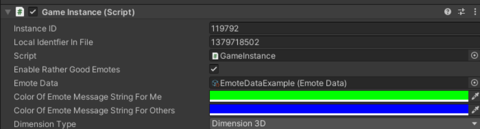

# EmoteChat


**Demo Video**

[](https://youtu.be/ktHKpvC-qPk)

**Author:** RatherGood1

**Version**: 0.4

Major update for MMORPG KIt 1.71.  
* Supports new PlayableCharacterModel and (previous) AnimatorCharacterModel. Some differences as to how these work are explained below.
* UI changes for separate tabbed chat areas supported. EmoteChat always shows to Local channel.

**Updated:** 5 Nov 21

**Compatibility:** Tested on Suriyun MMORPG Kit Version 1.71.

For previous version of kit (<1.67) use 0.3 version of EmoteChat.

**Description:** 
Provides slash command “/playdead” or key press will send emote command to all players in
scene. Animation plays for sender. Messages are generated depending on the listener.

**Other Dependencies:**

You need to provide your own animations. Demo uses simple kit animations.

**Core MMORPG Kit modifications:**

1. Add this line of code:
```csharp
 chatMessage = CheckAndReplaceChatMsgEmotes(chatMessage);
 ```

 to UIChatHandler in:

    \Assets\UnityMultiplayerARPG\Core\Scripts\UI\Chat\UIChatHandler.cs

 **NOTE:**

    NO LONGER Requires changes to any UIGamePlay components. This function will capture received chat and modify it before displaying automatically.

Modification:

```csharp 
    private void OnReceiveChat(ChatMessage chatMessage)
        {
            if (this == null)
            {
                RemoveOnClientReceiveChatMessage();
                return;
            }

            //***RG Emote modification***
            chatMessage = CheckAndReplaceChatMsgEmotes(chatMessage);

            if (!ChannelBasedChatMessages.ContainsKey(chatMessage.channel))
                ChannelBasedChatMessages.Add(chatMessage.channel, new List<ChatMessage>());
            ChannelBasedChatMessages[chatMessage.channel].Add(chatMessage);
            if (ChannelBasedChatMessages[chatMessage.channel].Count > chatEntrySize)
                ChannelBasedChatMessages[chatMessage.channel].RemoveAt(0);

            ChatMessages.Add(chatMessage);
            if (ChatMessages.Count > chatEntrySize)
                ChatMessages.RemoveAt(0);

            FillChatMessages();
        }
```

2.  Add "partial" modifyer to PlayableCharacterModel in:

    \Assets\UnityMultiplayerARPG\Core\Scripts\GameData\Model\3D\PlayableCharacterModel.cs

```csharp 
public partial class PlayableCharacterModel : BaseCharacterModel
```

**Instructions for use:**

1.  Right click in a folder and select: Create -\> RatherGoodGames -\> EmoteData (or modify example scriptable object) and set up your animations actions as desired. (See examples below)

2.  Place the EmoteData database component on your GameInstance and "Enable Rather Good Emotes". 



3. Start Emoting! (Is that a word?)

**EmoteData Fields:**


**slashCmdText**:  This is the text the user types in the chat window to activate the emote.

    NOTE: The text is NOT case sensitive and not required to add a '/' before the word here, only in the chat window.

**KeyName**: Assign a key name to enable using this animation to be activated by key press. The name must EXACTLY (this one is case sensitive) match the name used in your InputSettingsManager component below your GameInstance in your Init scene. (See example below).


**ActionAnimations**: Insert the appropriate animations. (Not all animation
types work with ActionAnimations)

    Multiple animations will play one after the other.

**PlayClipAllLayers:**  All layers will play animation on the full body. If false will only play on upper body.

    ONLY used for AnimatorCharacterModel

**AnimSpeedRate:** (0 will be ignored) Animation speed can be adjusted. 1(or 0) is normal speed. 0.1 will be 1/10th speed.

**TriggerDurationRate:**: N/A No effect for Emotes currently.

**DurationType:** ByClipLength will let animation play in full.

**Extra Duration:** After animation plays this time will be added before ending.

**AudioClips:** Will play audio immediately on Emote start if included.

**Avatar Mask:** 

Provide a mask that includes the parts of the avatar you wish to animate with this remove. Typically a full body mask or upper body mask is sufficient.

    ONLY used for PlayableCharacterModel

**EmoteMessageStringForMe:** 

The sender of the emote will see this message. The typed message will not be
shown.

    Ex: User “Player1” types “/playDead”

    His chat reads: “[You are playing dead]”.

**EmoteMessageStringForOthers**:

From the above example other players will see: 

    [Player1 is dead…or is he?]

**EXAMPLES:**

**/wave**

Simple example of a single short animation. CancelOnMovementState is not checked so will always play in full even in player moves. However, another action (i.e. attack, spell etc. will override this.)

    For AnimatorCharacterModel CancelOnMovementState is not checked so will always play in full even in player moves.

    For PlayableCharacterModel a TopMask is included that only animates the upper body.


**/squat**

Single long animation about \~25 seconds. Can be canceled by moving or jumping.


**/playdead**

Single short animation. However “extraDuration is set to 1000 seconds”. So after the death animation plays the player will remain in the playdead state until the “ExtraDuration” runs out or they move or jump.


**/sit**

    NOTE: PIC not updated. OLD example showed 2 animations. A sit animation and then transition to sit idle. 

The extra duration is set to 10 so sitIdle will loop for 10 seconds or until movementState changes.


**Done.**


[](https://www.paypal.com/cgi-bin/webscr?cmd=_s-xclick&hosted_button_id=L7RYB7NRR78L6)